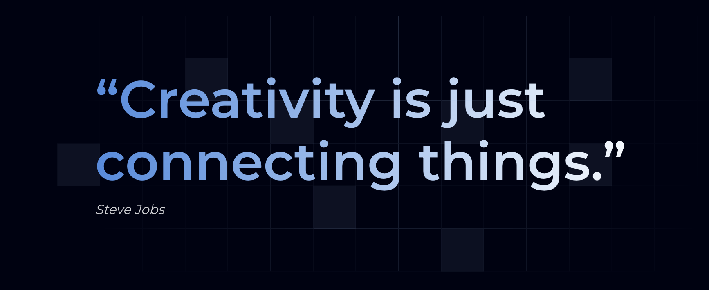
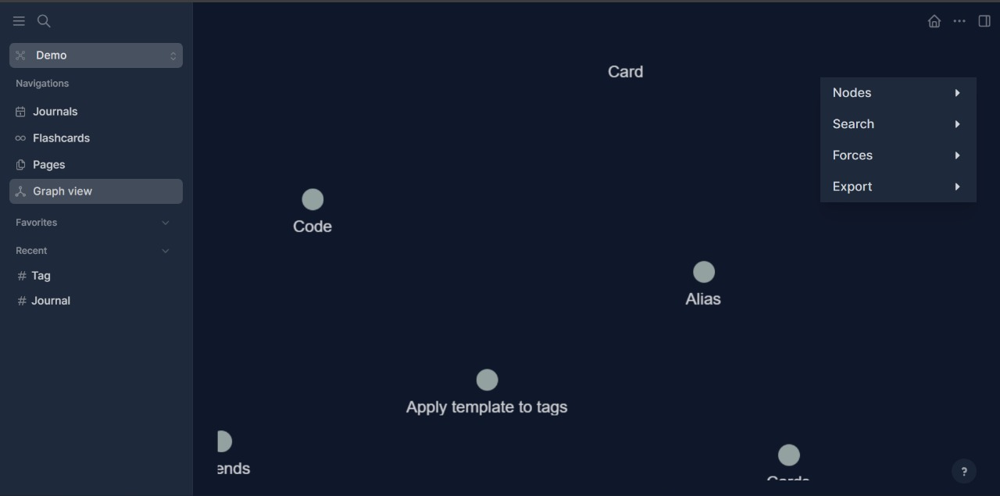
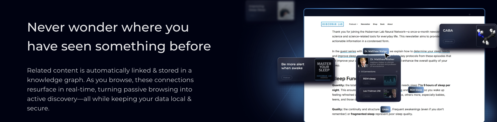
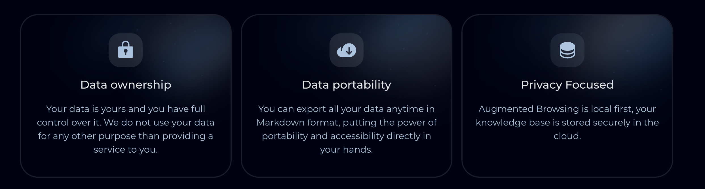
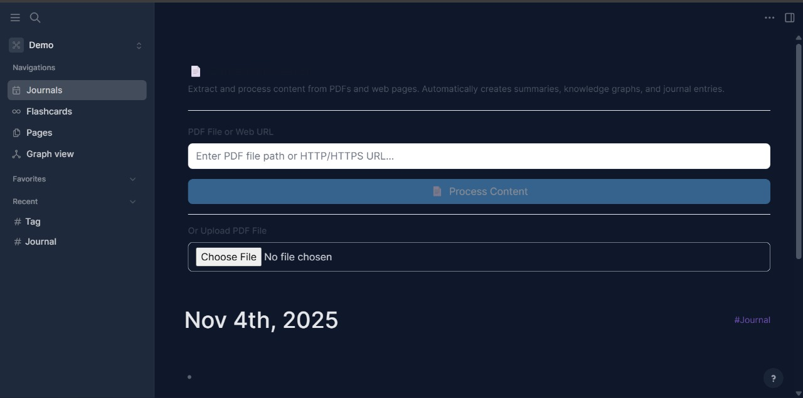
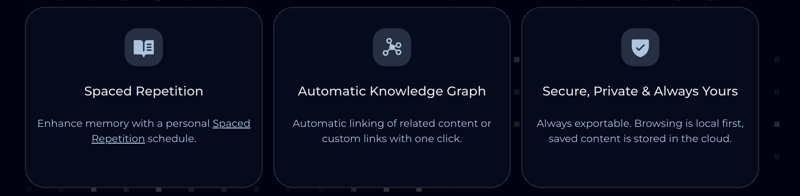

# Memory-AI
Your self-organizing knowledge base, where you can summarize and chat with any online content.


<!-- logo -->
<p align="center">
    <a href="https://patternautomation.io/memory-ai" alt="MemoryAI Logo">
    </a>
</p>

<h1 align="center"> MemoryAI </h1>

<h4 align="center">
    A privacy-first, open-source platform for knowledge management and collaboration
</h4>

<div align="center">
    <a href="https://patternautomation.io/memory-ai">Home Page</a> |
    <a href="https://patternautomation.io/memory-ai">Documentation</a> |
    <a href="https://patternautomation.io/memory-ai">Support</a>
</div>
<br></br>

<p align="center">
    <a href="https://patternautomation.io/memory-ai">
        </a>
</p>

<!-- dev badges -->
<p align="center">
    <a href="https://github.com/larscherry/MemoryAI/blob/master/LICENSE.md" alt="License">
        </a>
    <a href="https://github.com/larscherry/MemoryAI/releases">
        </a>
</p>

## Table of Contents

  * [🧠 About MemoryAI](#-about-memoryai)
  * [✨ Key Features](#-key-features)
  * [👀 How to Use](#-how-to-use)
  * [🛠️ Development](#️-development)
  * [📚 Learn More](#-learn-more)
  * [🤝 Contributing](#-contributing)
  * [📄 License](#-license)

## 🧠 About MemoryAI

**MemoryAI** is a powerful **knowledge management** and **collaboration** platform designed with **privacy**, **longevity**, and **user control** at its core. Built for individuals and teams who value organized thinking and secure data management.

MemoryAI offers a comprehensive suite of tools for **knowledge management**, **collaboration**, **PDF annotation**, and **task management** with support for multiple file formats, including **Markdown** and **Org-mode**.

The **Whiteboard** feature lets you organize your knowledge and ideas using a spatial **canvas** with **shapes**, **drawings**, **website embeds**, and **connectors**. You can **visually group** and **link** your **notes** and external media (such as **videos** and **images**), enabling visual thinkers to compose, remix, **annotate**, and connect content from their knowledge base.


<p align="center">
    <a href="https://patternautomation.io/memory-ai" alt="MemoryAI Logo">
    </a>
</p>

Whether you're a student, researcher, developer, or professional, MemoryAI helps you capture, organize, and connect your ideas in a way that makes sense to you.

<p align="center">
    <a href="https://patternautomation.io/memory-ai" alt="MemoryAI Logo">
    </a>
</p>

## ✨ Key Features

- 🔒 **Privacy-First**: Your data stays yours - complete control over your information

<p align="center">
    <a href="https://patternautomation.io/memory-ai" alt="MemoryAI Logo">
    </a>
</p>


- 📝 **Flexible Note-Taking**: Support for **Markdown** and **Org-mode** formats
- 🎨 **Visual Whiteboard**: Organize ideas using a spatial canvas with shapes, drawings, and connectors
- 📄 **PDF Annotation**: Annotate and reference PDFs directly within your notes

<p align="center">
    <a href="https://patternautomation.io/memory-ai" alt="MemoryAI Logo">
    </a>
</p>

- ✅ **Task Management**: Built-in task tracking and project management capabilities

<p align="center">
    <a href="https://patternautomation.io/memory-ai" alt="MemoryAI Logo">
    </a>
</p>

- 🔗 **Bi-directional Linking**: Connect your thoughts and create a knowledge graph
- 🎨 **Beautiful Blue Theme**: Modern, eye-friendly interface with deep purple accents
- 🔌 **Plugin Ecosystem**: Extend functionality with community-created plugins
- 🔄 **Real-Time Collaboration**: Sync and collaborate across multiple devices
- 📊 **Database & File Graphs**: Choose between database-backed or file-based storage
- 🌐 **Open Source**: Fully transparent and community-driven development

## 👀 How to Use

To start using MemoryAI, follow these simple steps:

### Quick Start

1. Clone this repository:
   ```bash
   git clone https://github.com/larscherry/MemoryAI.git
   cd MemoryAI
   ```

2. Install dependencies:
   ```bash
   yarn install
   ```

3. Run the development server:
   ```bash
   yarn app-watch
   ```

4. Open your browser to `http://localhost:3001`

5. Start writing and organizing your knowledge! ✍️

That's it! You can now enjoy the benefits of using MemoryAI to streamline your workflow, manage your projects, and stay on top of your goals. Have fun! 🎉

## 🛠️ Development

### Prerequisites

- Node.js (v16 or higher)
- Yarn package manager
- Java JDK (for ClojureScript compilation)

### Setting Up Development Environment

For detailed development setup instructions:
- **macOS/Linux**: See [Develop MemoryAI](docs/develop-logseq.md)
- **Windows**: See [Develop MemoryAI on Windows](docs/develop-logseq-on-windows.md)
- **Mobile**: See [Mobile Development Guide](docs/develop-logseq-on-mobile.md)

### Available Commands

```bash
# Start development server
yarn app-watch

# Run tests
yarn test

# Build for production
yarn build

# Clean build artifacts
yarn clean
```

### Project Structure

- `src/main/` - Core application code (ClojureScript)
- `src/electron/` - Electron desktop app code
- `packages/ui/` - UI components and styling
- `resources/` - Static resources and assets
- `static/` - Built assets served in development

## 📚 Learn More

* Website: [patternautomation.io/memory-ai](https://patternautomation.io/memory-ai)
* Documentation: [patternautomation.io/memory-ai](https://patternautomation.io/memory-ai)
* Support: [patternautomation.io/memory-ai](https://patternautomation.io/memory-ai)

## 🤝 Contributing

We welcome contributions from the community! To start contributing:

1. Fork the repository
2. Create a feature branch (`git checkout -b feature/amazing-feature`)
3. Make your changes
4. Commit your changes (`git commit -m 'Add amazing feature'`)
5. Push to the branch (`git push origin feature/amazing-feature`)
6. Open a Pull Request

For more details, see [CONTRIBUTING.md](CONTRIBUTING.md).

## 💡 Feature Requests

Have an idea for improving MemoryAI? We'd love to hear it! Please open an issue on GitHub with the `enhancement` label.

## 🔌 Plugin API

MemoryAI provides a plugin API that enables developers to create custom plugins and extend functionality. Check the documentation for details on plugin development.

## ✨ Technology Stack

MemoryAI is built with modern, robust technologies:

* **[Clojure & ClojureScript](https://clojure.org/)** - A dynamic, functional programming language
* **[DataScript](https://github.com/tonsky/datascript)** - Immutable database and Datalog query engine
* **[Electron](https://www.electronjs.org/)** - Cross-platform desktop applications
* **[React](https://reactjs.org/)** - UI component library
* **[Tailwind CSS](https://tailwindcss.com/)** - Utility-first CSS framework

## 📄 License

MemoryAI is open source software licensed under the AGPL-3.0 license. See [LICENSE.md](LICENSE.md) for details.

## 🙏 Acknowledgments

MemoryAI is inspired by and builds upon ideas from:
- **Roam Research** - Networked thought and bi-directional linking
- **Org Mode** - Plain-text organization and productivity
- **TiddlyWiki** - Non-linear personal web notebook
- **Workflowy** - Nested list organization

We're grateful to these projects and their communities for pioneering new ways of thinking about knowledge management.

## 🌟 Star History

If you find MemoryAI useful, please consider giving it a star on GitHub! ⭐

---

<p align="center">
    Made with 💜 by the MemoryAI community
</p>

<p align="center">
    <a href="https://patternautomation.io/memory-ai">Website</a> •
    <a href="https://github.com/larscherry/MemoryAI/issues">Issues</a> •
    <a href="https://github.com/larscherry/MemoryAI/discussions">Discussions</a>
</p>

